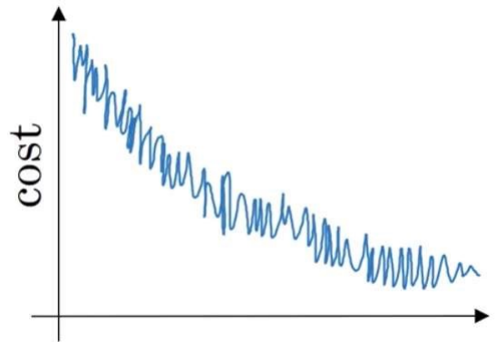
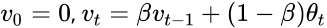
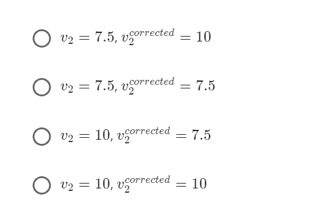
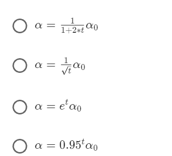
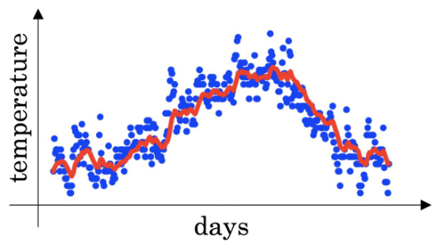
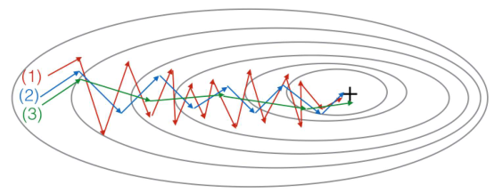

## 优化算法
评分测验 • 20 分钟 • 总分10分
##### 1. 若输入第8个mini-batch的第7个样本，请问用什么符号来指代第3层激活函数？  
 

##### 2. 下列关于mini-batch的梯度下降的说法中，你同意哪一个？   
A.使用mini-batch梯度下降训练一个epoch(通过训练集)快于使用batch梯度下降训练一个epoch。  
B.对mini-batch梯度下降进行一次迭代（计算单次mini-batch）快于对batch梯度下降进行一次迭代。  
C.实施mini-batch梯度下降时，无需对不同的mini-batch显式for循环调用，算法即可同时处理所有mini-batch（向量化）。 

##### 3. 为什么mini-batch的最优大小通常既不是1也不是m，而是介于二者之间？（多选）
A.如果mini-batch的大小是1，则需要处理整个训练集才能取得进展。  
B.如果mini-batch的大小是m，则需要进行随机梯度下降，常常慢于mini-batch梯度下降。  
C.如果mini-batch的大小是m，则需要进行batch梯度下降,只有整个训练集处理完之后才能取得进展。  
D.如果mini-batch的大小是1，则将丢失在mini-batch的向量化样本的优势。

##### 4. 假设学习算法成本为J，表示为关于迭代次数的一个函数，如下图所示：
 
##### 你同意下列哪一个说法？  
A.如果使用的是mini-batch梯度下降，这看起来是可以接受的。但如果使用的是batch梯度下降，则某个地方出问题了。  
B.如果使用的是mini-batch梯度下降，则某个地方出问题了。但如果使用的是batch梯度下降，这看起来是可以接受的。  
C.无论使用的是batch梯度下降还是mini-batch梯度下降，这都是可以接受的。  
D.无论使用的是batch梯度下降还是mini-batch梯度下降，一定都有地方出问题了。

##### 5.假设卡萨布兰卡1月份开头两天温度相同：
##### 1月1号：θ1=10℃
##### 1月2号：θ2=10℃
##### （课上使用的是华氏度，这里考虑到世界范围内广泛使用的公制，所以将使用摄氏度）
##### 假设用一个指数加权平均来跟踪温度（β=0.5）：

#####  如果v2是第2天的无偏差修正估计值，v2corrected是偏差修正估计值，则它们分别为多少？（你可能不需要计算器就可以算出以上值，事实上你也真的不需要。记住偏差修正的功能。）
 

##### 6.下列哪一个不是良好的学习率衰减表达式？其中，t代表epoch数。
 

##### 7.根据vt=βvt-1+(1-β) θt，对伦敦温度数据集使用指数加权平均。下图中的红线是根据β=0.5计算出来的。当改变β值时，红色曲线将发生何变化？（检查选项中两项即可）（多选）    
 
A.β下降，红线将略微右移。  
B.β上升，红线将略微右移。  
C.β下降，红线内将出现更多振荡。  
D.β上升，红线内将出现更多振荡。

##### 8.考虑下图：
  
##### 这些图表通过梯度下降产生；梯度下降所根据的momentum分别是β=0.5和β=0.9。曲线和算法如何相互对应？
A.（1）momentum梯度下降（小β）。（2）梯度下降。（3）momentum梯度下降（大β）  
B.（1）梯度下降。（2）momentum梯度下降（小β）。（3）momentum梯度下降（大β）  
C.（1）momentum梯度下降（小β），（2）momentum梯度下降（小β），（3）梯度下降    
D.（1）梯度下降。（2）momentum梯度下降（大β）。（3）momentum梯度下降（小β）

##### 9.假设深度网络中batch梯度下降正花费过长的时间寻找一个小的成本函数J(W1,b1,...,WL,bL)的参数值。下列方法中，哪一个有助于找到小的J的参数值？（检查所有列出方法）（多选）  
A.尝试使用Adam  
B.尝试对权重进行更优的随机初始化  
C.尝试mini-batch梯度下降  
D.尝试将所有的权重初始化到0  
E.尝试调整学习率α

##### 10.下列关于Adam的说法中，哪一个有误？
A.Adma中学习率超参数α常常需要调整。  
B.Adam结合了RMSProp和momentum的优点。  
C.Adam需要配合batch梯度计算使用，而非mini-batch。  
D.Adam中，我们通常会使用超参数β1，β2和ε的“默认”值（β1=0.9,β2=0.999,ε=10e-8）。