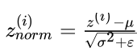
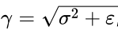

##  超参数调整，Batch归一化，编程框架
 **总分 10**   
 **1.若对超参数进行大规模搜索，应使用网格而非随机求值，以使得搜索结构更具系统性，而非依赖偶然性。正确还是错误？**   

- 错误  
- 正确

 **2.每一个超参数，如果设置不当，都会对训练产生巨大的负面影响，所以所有的超参数对于调优都同样的重要。正确还是错误？**    

- 错误  
- 正确

 **3.超参数搜索中，是只针对单一模型（“熊猫法”）还是多模型同时训练（“鱼子酱法”）主要取决于：**   
A.神经网络中是否存在局部最小（以及鞍点）  
B.需优化的超参数个数  
C.是否使用batch优化或mini-batch优化  
D.计算能力可调用量  

 **4.若0.9＜=β＜=0.99(momentum超参数)，下列哪一项适合列举出β值？**   
 A.r = np.random.rand(), beta = 1-10\*\*(-r-1)     
 B.r = np.random.rand(), beta = r\*0.9 + 0.09   
 C.r = np.random.rand(), beta = 1-10\*\*(-r+1)  
 D.r = np.random.rand(), beta = r\*0.09 + 0.9  

 **5.找到合适的超参数值是非常费时间的。所以一般来说在项目开始应寻找一次非常合适的超参数，以便之后无需重复调整。正确还是错误？**   

- 正确
- 错误

 **6.如果要对神经网络中的第l层运行视频中提到的batch归一化，则哪一个值需要归一化的是？** 

 **7.标准化方程中，为什么要使用epsilon?？**   
A.使标准化更加精确
B.防止μ过小  
C.加快收敛  
D.防止除数为零 

 **8.关于Batch归一化中的γ和β，下列说法中哪一项是正确的？**   
A.β和γ是这一算法的超参数，通过随机抽样来调整。  
B.它们可以通过Adam，momentum梯度下降或RMSprop学习，不仅仅只有梯度下降这一种方法。  
C.每一层γ∈ℜ和β ∈ ℜ各有一个全局值，适用于该层所有隐藏层单元。  
D.最优值γ =  ，β = μ。  
E.它们确定每一层线性变量z[l]的平均值和方差。

 **9.使用Batch归一化训练神经网络后，测试时使用新样本评估神经网络时应：**   
A.使用最近的mini-batch的μ和σ^2值，以达到最需正则化。    
B.使用训练时出现的mini-batch指数加权平均数来估计μ和σ2，以达到最需正则化。  
C.如果对256次例子的mini-batch进行Batch归一化，那么若选择一例测试评估，重复该例256次，即可得到与训练时相同的mini-batch大小。    
D.由于单一测试例是不能正则化的，遇到使用μ和σ^2正则化的步骤时，应该跳过该步骤。  

 **10.下列关于深层学习编程框架的说法中，哪些是正确的？（答案可能不止一项）**   
A.一般来说，比起低级语言（如Python），编程框架可以使用较少的代码编写深度学习算法。  
B.即使项目开源，良好的项目管理依然有助于确保其长期开源，而非只对为一家公司受益而进行关闭或调整。  
C.运行深层学习编程框架要求支持云计算的机器。

答案请参见：[【中英】【吴恩达课后测验】Course 2 - 改善深层神经网络 - 第三周测验](https://blog.csdn.net/u013733326/article/details/79959713)  
